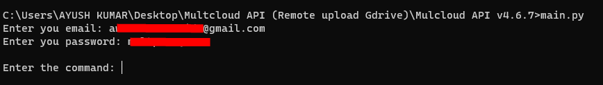
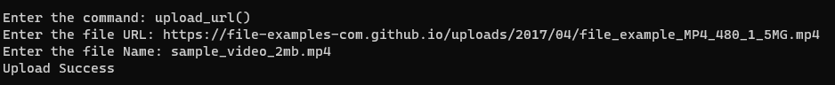
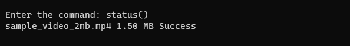
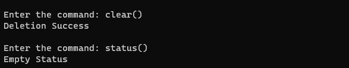
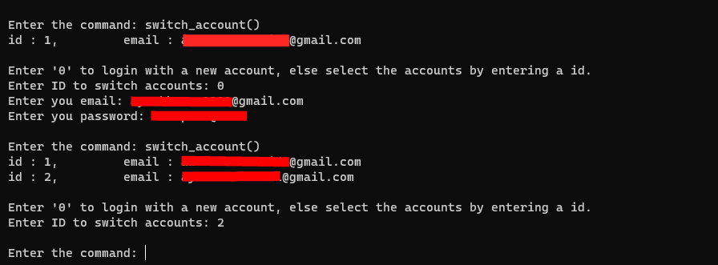
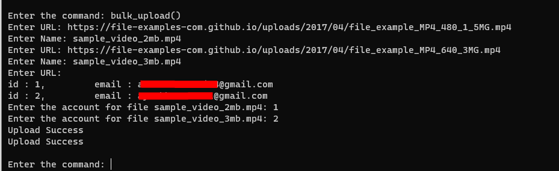
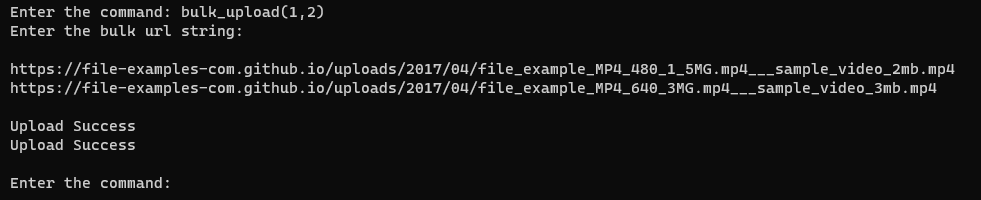
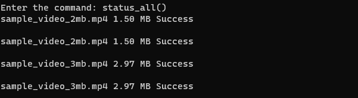
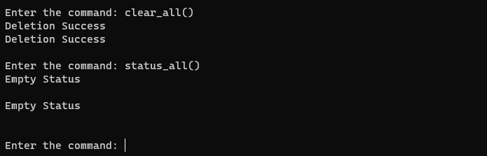
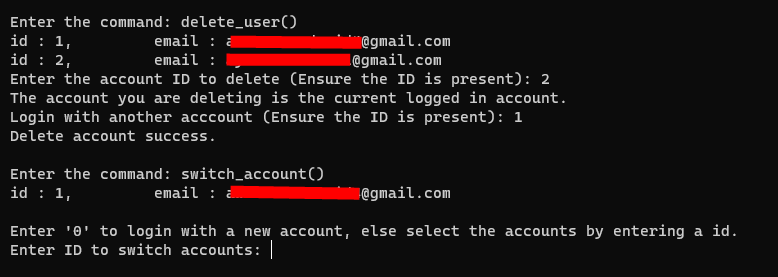

# Multcloud remote upload API (Gdrive) [v4.6.7]

 

The repo conins script to remotly upload link to google drive using **new** multcloud account.
### Features
- Supports multiple account login.
- Supports bulk upload (multiple url in different account)
- Logging in with captcha 
- Multiple level logging to reduce login time and captcha trails.

### Installing the requirements.
Install the requirements from requirements.txt by using `python -m pip install -r requirements.txt` in main or virtual enviornment.

### Running with command prompt
Run the *main.py* file using `main.py` (windows) or `python3 main.py` (linux) command.
*When logging in for first time the script will ask for captcha, a new image window will open for captcha. Enter the captcha in command line*

## Functions
### upload_url
Uploads the file with link to the root folder of google drive.

### status
Status of all the task present in the list.

### clear
Clears all 'completed' and 'failed' task present in the list. Running tasks will keep running.

### switch_account (also adds new account)
The function can be used to add new accounts and switch between different accounts.

### bulk_upload
Bulk upload command can be used to upload multiple link in different accounts. The command can be used in 2 formats. 

#### 1. No parameter with function
You can just call the function and give diffrent file_name, url and account ID for respective upload. *Enter a blank url to break input cycle.*
Example -

#### 2. Using parameterized input for account ids and '___' for url and name.
Faster way to input the url is to provide account ids as patameters in bulk_upload function. The bulkupload string could be given in form of `{url}___{file Name}`. Example -

### status_all
Provides Status of all the task present from all your accounts.

### clear_all
Clears all 'completed' and 'failed' task present in the list of all the account. Running tasks will keep running.

### delete_user
Deletes saved account.

### Update Password
Use the *switch_account* command to enter the username and password. The script will update the password if username already exists.

*Multcloud images and graphics used in the used in the repo belong to their respective owners.*